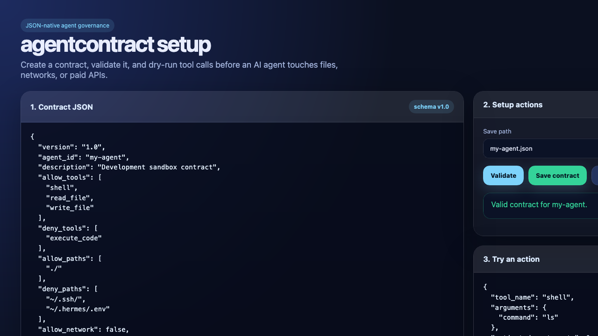

# agentcontract
<p align="center">
  <a href="https://buymeacoffee.com/rusty4" target="_blank">
    
  </a>
</p>


**Agent contracts that don't lie.**

A JSON-native, framework-agnostic capability contract for LLM-powered agents. Declare
what an agent *can* and *cannot* do — which tools, which files, which network calls,
which cost caps — and get a single pre-execution gate that any runtime (Hermes, LangChain,
raw OpenAI function-calling) calls before every action.

```
agc init default-contract        # scaffold a contract
agc validate contracts/default.json
agc gate contracts/default.json --action '{"tool_name":"shell","estimated_cost_cents":0}'
agc gui                          # local browser GUI for setup + dry-runs
```



Philosophy: contracts live in version control, can be audited in CI, and work over JavaScript and every LLM framework today.

---

## Quick-start (5 minutes)

### 1 — Install

```bash
pip install agentcontract
```

### 2 — Scaffold a contract

```bash
# Interactive wizard
agc init my-agent --hermes

# Result: ─ ~/.hermes/contracts/my-agent.json ─
# {
#   "version": "1.0",
#   "agent_id": "my-agent",
#   "description": "...",
#   "allow_tools": ["shell", "read_file", "write_file"],
#   "deny_tools": ["execute_code"],
#   "allow_paths": ["~/dev/"],
#   "deny_paths": ["~/.ssh/", "~/.hermes/.env"],
#   "allow_network": false,
#   "max_cost_per_action_cents": 100,
#   "require_approval": [],
#   "max_iterations": 90
# }
```

### 3 — Set up the enforcement interface

```python
# interactive-cli
from agentcontract import ContractEnforcer, ContractViolation, Contract

# load from disk, path, or raw JSON string
enforcer = ContractEnforcer(
    "~/.hermes/contracts/my-agent.json",   # ← accepts str
    # OR: Contract.parse_file(...),
    # OR: '{"agent_id":"my-agent", ...}',    # raw JSON string
)

# after meta[let's define the actual API call first], get to the distinction between `check()` and `enforce()`
try:
    result = enforcer.enforce("shell", estimates_cost_cents=0)
    # ALLOW → result returned, call proceeds
except ContractViolation as exc:
    # BLOCK / REQUIRE_APPROVAL → agent stopped here
    log(exc)                               # or return, or prompt user
    ...

# return-value pattern (no exception)
result = enforcer.check("shell", estimated_cost_cents=0)
if result.decision == "ALLOW":
    ... # proceed
else:
    reason = "; ".join(v.message for v in result.violations)
    return f"Blocked: {reason}"
```

### 4 — Optional: enforce every tool call in Hermes

```python
# in your Hermes agent loop or HermesMCPContext pre-call hook:
from agentcontract import ContractEnforcer

enforcer = ContractEnforcer(active_contract_path)

def before_tool_call(tool_name, **kwargs):
    try:
        enforcer.enforce(tool_name, **kwargs)
    except ContractViolation as exc:
        # enforce() already raised → return/abort are your call
        return str(exc)
    return OK
```

---

## Contract schema

```json
{
  "version": "1.0",
  "agent_id": "my-agent",
  "description": "Development sandbox contract",
  "allow_tools": ["shell", "read_file", "write_file"],
  "deny_tools": ["execute_code"],
  "allow_paths": ["~/dev/"],
  "deny_paths": ["~/.ssh/", "~/.hermes/.env"],
  "allow_network": false,
  "max_cost_per_action_cents": 100,
  "require_approval": ["execute_code"],
  "max_iterations": 90
}
```

### Fields

| Field | Type | Default | Meaning |
|---|---|---|---|
| `version` | string | `"1.0"` | Schema version |
| `agent_id` | string | *required* | Stable identity for this contract |
| `description` | string | `""` | Human-readable purpose |
| `allow_tools` | `[string] | null` | `null` = all tools allowed; list = explicit allowlist |
| `deny_tools` | `[string]` | `[]` | Always blocked, even if in `allow_tools` |
| `allow_paths` | `[string] | null` | `null` = all paths; list = filesystem glob allowlist |
| `deny_paths` | `[string]` | `[]` | Always denied filesystem paths (globs supported) |
| `allow_network` | bool | `true` | Whether this agent may make outbound network calls |
| `max_cost_per_action_cents` | `int | null` | `null` | Cap per-action cost in USD cents |
| `require_approval` | `[string]` | `[]` | Tool names that need phase gate / sign-off |
| `max_iterations` | `int | null` | `null` | Cap recursive loop depth |

---

## Enforcement interface

### `ContractEnforcer`

Loads a contract from disk, path, or JSON string and keeps it in interpreter memory.

```python
from agentcontract import ContractEnforcer, Contract, AuditTrail

# Three constructor forms:
enforcer1 = ContractEnforcer("contracts/default.json")                 # path / URL
enforcer2 = ContractEnforcer('{"agent_id":"dev", ...}')               # raw JSON string
enforcer3 = ContractEnforcer(Contract(agent_id="dev", ...))           # Pydantic object
```

**`check(tool_name, ...) -> GateResult`**  
Return-value pattern. Non-throwing.

```python
result = enforcer.check("shell", estimated_cost_cents=0)
# GateResult.decision  → GateDecision.ALLOW | BLOCK | REQUIRE_APPROVAL
# result.violations    → list[GateViolation]
# result.metadata      → dict[str, Any]
```

**`enforce(tool_name, ...) -> GateResult`**  
Exception-based pattern. BLOCK / REQUIRE_APPROVAL raise `ContractViolation`.

```python
try:
    enforcer.enforce("executability_code", arguments={"code": "x=1"})
    # ALLOW → returns GateResult, call proceeds
except ContractViolation as exc:
    # BLOCK or REQUIRE_APPROVAL → call is aborted here
    reason = str(exc)
    log(reason)
```

**`check_hermes(mcp_ctx: HermesMCPContext) -> GateResult`**  
Hermes MCP pre-call adapter:

```python
from agentcontract.sdk import HermesMCPContext, HermesMCPFormatter
from agentcontract.core import ActionContext

ctx = HermesMCPContext(
    context=ActionContext(
        tool_name="http_get",
        requires_network=True,
        paths_touched=[],
        arguments={},
        estimated_cost_cents=0,
    )
)
result = enforcer.check_hermes(ctx)
# Non-ALLOW decisions land in both ring buffer AND persistent JSONL log
```

**`replace_contract(new, source=None)`**  
Atomic hot-swap at runtime. Audit trail flushes automatically. Returns `True` on success.
Rejects bad JSON / invalid schema on stderr and keeps the old contract intact.

---

## Audit and dry-runs

```python
# tail the in-memory ring buffer
tail = enforcer.tail_audit(limit=10)
# [{"tool_name": "shell", "decision": "ALLOW", ...}, ...]

# capacity is configurable; default 128
enforcer = ContractEnforcer(path, audit_capacity=10)
len(enforcer.audit_tail())  # ≤ 10 at any time
```

### Hermes MCP formatting

```python
from agentcontract.sdk import HermesMCPFormatter

fmtr = HermesMCPFormatter(enforcer.contract)
rejected_record = fmtr.format_gate_rejection(result)
if mussand_deletion_flag called):
    result = enforcer.enforce("docker_build", estimated_cost_cents=5)   # $ 0$.05
    result = enforcer.enforce("embed_memory")                             # local/read-only
```

---

## CLI reference

```
agc init <agent-id> [--hermes]       # scaffold a contract
agc validate <contract.json>          # schema + cross-field rules
agc gate <contract.json> --action <json-string>   # dry-run one tool call
agc gui                               # localhost browser GUI
agc schema                            # print JSON schema to stdout
agc schema > ~/.vscode/schemas/agentcontract.json   # tooling integration
```

### GUI — contract editor & dry-run studio

`agc gui` starts a localhost-only setup app at `http://127.0.0.1:8765/`.

**Panel 1 — contract editor**
- JSON editor with a production-safe starter template pre-loaded
- `Save & exit` → writes `~/.hermes/contracts/<agent-id>.json`

**Panel 2 — validate**
- One-click schema validation: shows Pydantic error messages in real time
- Covers all cross-field rules (`allow_tools` vs `deny_tools` overlap, etc.)

**Panel 3 — dry-run**
- Paste an `ActionContext` JSON payload
- `Run gate` → shows `ALLOW`, `BLOCK`, or `REQUIRE_APPROVAL` with full `GateResult`
- Great for previewing a new contract's behaviour before saving

---

## Engine (Python SDK)

```python
from agentcontract.core import Contract, ActionContext, GateDecision, gate

contract = Contract.model_validate_json(Path(".agentcontract.json").read_text())
result  = gate(
    contract,
    ActionContext(
        tool_name="shell",
        arguments={"command": "rm -rf /"},
        estimated_cost_cents=0,
        paths_touched=["/"],
        requires_network=False,
    ),
)

# result.decision == GateDecision.BLOCK
# result.violations → list[GateViolation]
```

---

## Schema (open)

`agent_to_json_schema()` returns the JSON Schema draft 2020-12 object. Wire it into VS Code, your form builder, or your CI linter:

```bash
agc schema | jq '.' > ~/.vscode/schemas/agentcontract.json
```

---

## CI usage

```yaml
# .github/workflows/contract-check.yml
- name: Validate agent contracts
  run: |
    install agentcontract
    agc validate contracts/prod-agent.json
    agc gate contracts/prod-agent.json \
        --action '{"tool_name":"execute_code","arguments":{}}'
```

---

## License

MIT — see [LICENSE](LICENSE).
